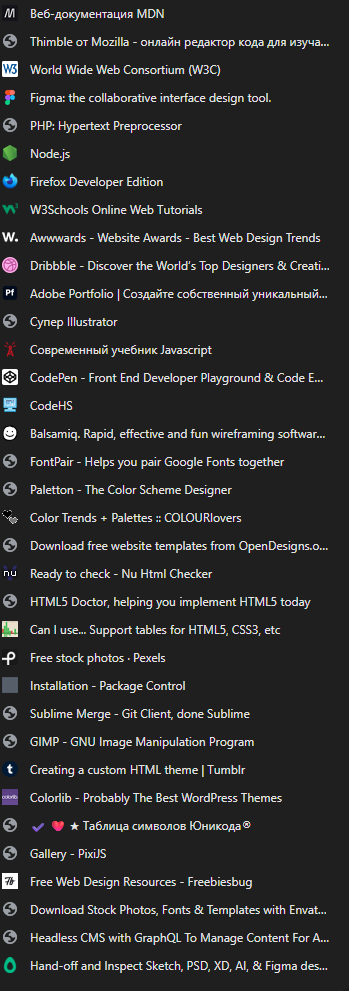

# ZERO GRAVITY DEV 🚀

> **"Leave the orbit of a junior developer."**

**Zero Gravity Dev** is an immersive, interactive resource portal designed to guide developers through their professional journey. It features a 3D environment, ambient audio system, and a gamified "Ascension Roadmap".


*(Note: Screenshot placeholder)*

## 🌌 Features

### 1. **The Event Horizon (Home)**
-   **Cinematic Intro**: A "Mission Briefing" screen that sets the tone for your coding journey.
-   **3D Starfield**: A living background powered by **React Three Fiber**. Move your cursor to navigate the void.
-   **Ambient Sound System**: Generative binaural beats (60Hz drone) created via **Web Audio API** for deep focus.

### 2. **Navigation Systems**
-   **Grid View**: A high-speed, filterable interface to access our curated resource database (`resources.ts`).
-   **Roadmap View ("Ascension")**: A vertical timeline guiding you from **Ground Control** (HTML/CSS) to **Deep Space** (Architecture).

### 3. **Pocket Cosmos (Mobile)**
-   Fully optimized for mobile devices with:
    -   Stacked layouts.
    -   Touch-optimized targets.
    -   Responsive typography.

---

## 🛠️ Tech Stack

-   **Core**: React 19, TypeScript, Vite
-   **Styling**: Tailwind CSS v4 (Glassmorphism, Animations)
-   **3D**: Three.js, @react-three/fiber, @react-three/drei, Maath
-   **Icons**: Lucide React

---

## 🚀 Installation

1.  **Clone the repository**:
    ```bash
    git clone https://github.com/your-username/zero-gravity-dev.git
    cd zero-gravity-dev
    ```

2.  **Install dependencies**:
    ```bash
    npm install
    ```

3.  **Ignition**:
    ```bash
    npm run dev
    ```
    Access the terminal at `http://localhost:5173`.

---

## 🎧 Audio Control

-   The audio system is **OFF** by default.
-   Click the **Speaker Icon** in the bottom-right corner to engage the atmosphere.
-   The sound is generated in real-time (no external files).

---

**Status**: `ONLINE`
**Version**: `3.0.0 (STELLAR)`
